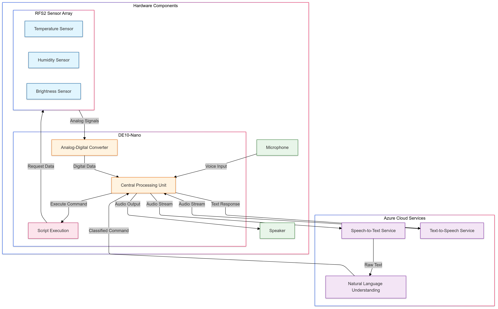
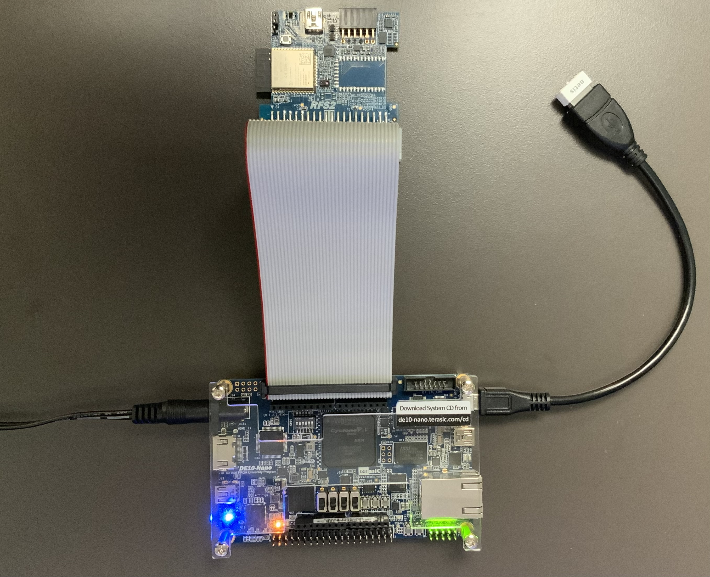

# Dawg: Your AI-Powered Home Buddy

Dawg is a voice-controlled smart home assistant that combines edge and cloud computing to provide real-time environmental monitoring and natural voice interactions. Built on the DE10-Nano platform with Azure cloud services integration.

## Features

- Voice-controlled environmental monitoring
- Real-time sensor data collection (temperature, humidity, brightness)
- Natural language processing for voice commands
- Edge computing capabilities with cloud AI integration



## Project Structure

```
dawg/
├── pyproject.toml
├── README.md   
└── src/
    ├── __init__.py
    ├── keyword_search.py  # Intent classification from voice input
    ├── main.py
    ├── sensor/        # Sensor interface package
    ├── speech2text.py
    ├── text2speech.py
    └── utils.py
```

### Component Description

- `keyword_search.py`: Analyzes transcribed text to detect user intent and categories
- `main.py`: Orchestrates the complete pipeline from audio input to response
- `sensor/`: Package handling RSF2 sensor array interactions
- `speech2text.py`: Handles audio transcription using Azure services
- `text2speech.py`: Converts text responses to speech output
- `utils.py`: Common utilities and helper functions

## Hardware Requirements

- DE10-Nano development board
- RSF2 Sensor Array
  - Temperature sensor
  - Humidity sensor
  - Brightness sensor
- WiFi dongle
- Microphone
- Speaker



## Software

- Python 3.x

## Installation

1\. Clone the repository:
```bash
git clone https://github.com/gabe-zhang/dawg.git
cd dawg
```

2\. Install dependencies:
```bash
pip install --upgrade pip
pip install -e .
```

## Configuration

### 1. Environment Variables

Set up the required Azure credentials in your environment:

```bash
export AZURE_SPEECH_API_KEY=<your_azure_speech_api_key>
```

For persistent configuration, add this to your `~/.bashrc` or `~/.zshrc`:

```bash
echo 'export AZURE_SPEECH_API_KEY=<your_azure_speech_api_key>' >> ~/.bashrc
source ~/.bashrc
```

### 2. Hardware Setup

Set up the DE10-Nano hardware configuration according to the provided system diagram:
- Connect the RSF2 Sensor Array
- Attach the WiFi dongle
- Connect microphone and speaker to appropriate ports


## Usage

Run the main application with an audio file input:

```bash
python -m src.main audio_input.wav
```

### Voice Commands

The system responds to natural language queries about:
- Temperature readings
- Humidity levels
- Light conditions
- Combined environmental status

Example commands:
- "What's the temperature?"
- "How humid is it?"
- "How bright is the room?"

## System Architecture

The system consists of three main components:

1. **Hardware Components**
   - RSF2 Sensor Array for environmental monitoring
   - DE10-Nano for local processing
   - Audio I/O devices

2. **Edge Processing**
   - Analog-to-Digital conversion
   - Central Processing Unit
   - Script execution
   - Command classification

3. **Cloud Services**
   - Azure Speech-to-Text
   - Azure Text-to-Speech

## Potential Improvements

- Audio kernel installation for on-device speakers and microphones
- Continuous audio interaction support
- Additional sensor integration (camera, accelerometer)
- Enhanced natural language processing capabilities

## Contributors

- [Gabriel Zhang](https://github.com/gabe-zhang)
- Zhenghao Wang
